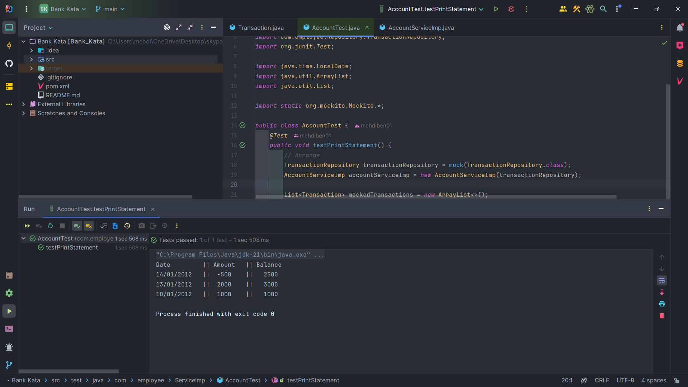

# BANK-KATA
# Service de Gestion de Compte Bancaire

Ce projet illustre un service simple de gestion de compte bancaire en utilisant Java.

## Fonctionnalités

*   **Dépôt:** Permet aux utilisateurs de déposer de l'argent sur leur compte.
*   **Retrait:** Permet aux utilisateurs de retirer de l'argent de leur compte.
*   **Relevé de Compte:** Affiche un relevé formaté de toutes les transactions du compte.

## Technologies

*   Java
*   Mockito (pour les tests unitaires)

## Comment Exécuter les Tests

Pour exécuter les tests, lancez simplement la classe `AccountTest` dans votre IDE.
## Structure du Code

*   La logique principale se trouve dans la classe `com.employee.ServiceImp.AccountServiceImp`.
*   `com.employee.Model.Transaction` représente le modèle de transaction avec la date, le montant et le solde.
*   `com.employee.Repository.TransactionRepository` est l'interface utilisée pour stocker les transactions. Bien qu'elle ne soit pas implémentée ici, elle est simulée (`mockée`) dans les cas de test.

## Tests Unitaires

Le projet comprend des tests unitaires pour les principales méthodes du service :

*   Les tests sont écrits en utilisant les bibliothèques JUnit et Mockito.
*   Les tests utilisent des "mocks" pour isoler la logique du service testée de ses dépendances externes, comme le dépôt.
*   Les tests vérifient que le service récupère correctement les transactions du dépôt et qu'il formate la sortie comme prévu.

